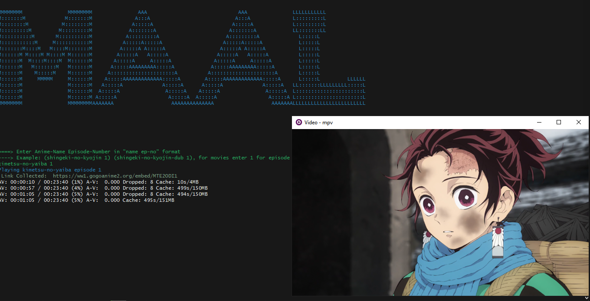

# MAAL

[](https://opensource.org/licenses/MIT)

[Features](#features) |
[Requirements](#requirements) |
[Installation](#installation) |
[License](#license)

## Features

- Watch specific anime series

## Requirements

[Golang](https://go.dev/) >= 1.7

[mpv](https://mpv.io) Video Player is required to be installed. The program will try to install the player in windows using the installation [script](./scripts/updater.ps1). In case of failure please install mpv globally by following instructions below:

### Windows

With [chocolatey](https://chocolatey.org/):

```bash
choco install mpv
```

### OSX

With [brew](https://brew.sh/):

```bash
brew install mpv
```

### Linux

```bash
sudo apt update
sudo apt install mpv
```

Or, you can follow the steps [here](https://mpv.io/installation/) for other mpv installation methods.

## Installation

```
git clone https://github.com/cosmicoppai/maal

-------------
Either build an executable file:

go build .
maal
-------------
or :

go run .
```

## License

[MIT](http://g14n.info/mit-license)
